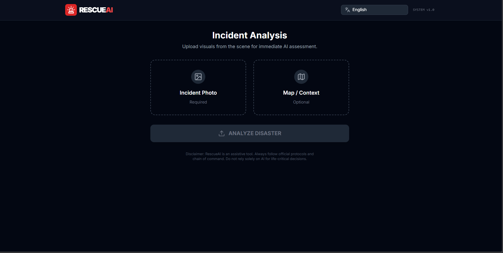
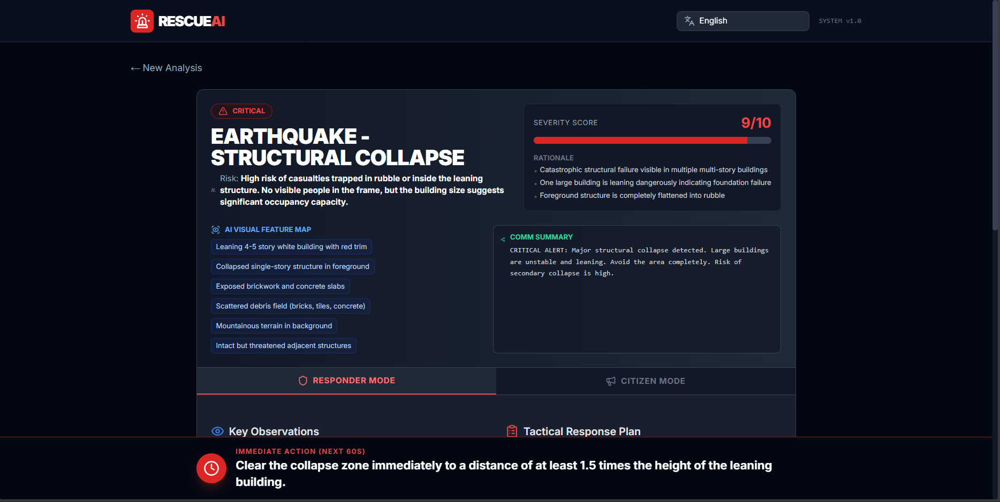

# 🚨 RESCUEAI
## Multimodal Disaster Response Intelligence System

RescueAI is a real-time **multimodal disaster response intelligence platform** built using **Google Gemini 3 Pro** in **Google AI Studio**.  
It transforms incident images and optional map/context screenshots into **structured, actionable emergency guidance** for both **first responders** and **civilians**.

---

## 🖼️ Application Preview

<div align="center">
  
  
</div>

<br/>

<div align="center">
  
  
  
</div>


---

## ✨ Key Features

### 🧠 Multimodal AI Scene Understanding
- Analyzes **incident images** to detect flooding depth, fire spread, smoke patterns, trapped vehicles, structural damage, and human presence.
- Powered by **Gemini 3 Pro’s vision and reasoning** capabilities.

### 📊 Structured Emergency Intelligence
Generates schema-validated outputs including:
- Disaster classification
- Urgency level
- Severity score (1–10) with rationale
- Estimated people at risk
- AI-derived visual feature map
- Required emergency resources
- Equipment checklist
- Safety precautions
- Step-by-step tactical response plan
- **Immediate 60-second action directive**

### 🧭 Map-Aware Reasoning (Optional)
When a map/context image is provided:
- Identifies **safe zones**
- Detects **blocked routes**
- Recommends the **best rescue approach**

### 👥 Dual-Mode Guidance
- **Responder Mode:** Tactical instructions for emergency teams
- **Citizen Mode:** Simplified safety guidance for civilians

### 🌍 Full Multilingual Support
- Entire UI **and AI-generated content** dynamically switch to the selected language
- Designed for **local community deployment**

### ⚠️ Ambiguity Handling
- Generates alternative scenarios with probabilities when visual information is uncertain

---

## 🏗️ Tech Stack

- **Frontend:** React + TypeScript  
- **UI:** Tailwind CSS  
- **AI:** Google Gemini 3 Pro (Multimodal)  
- **Platform:** Google AI Studio (Vibe Coding)  
- **Output Control:** Schema-validated JSON  
- **Localization:** Custom lightweight i18n system  

---

## 🚀 Run & Deploy with AI Studio

This repository contains everything required to run **RescueAI** locally.

### 🔗 View Live App
https://aistudio.google.com/apps/drive/1o-rfeBWA_19gkOFmQQiJ-U9enE4jzPQm?showAssistant=true&resourceKey=&showPreview=true&fullscreenApplet=true

---

## ▶️ Run Locally

### Prerequisites
- **Node.js** (v18+ recommended)
- **Gemini API Key**

---

### 1️⃣ Install Dependencies
```bash
npm install
